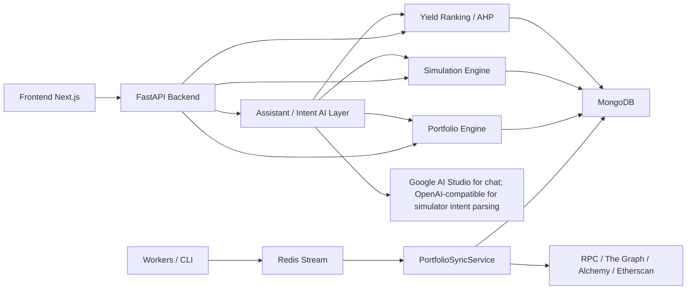
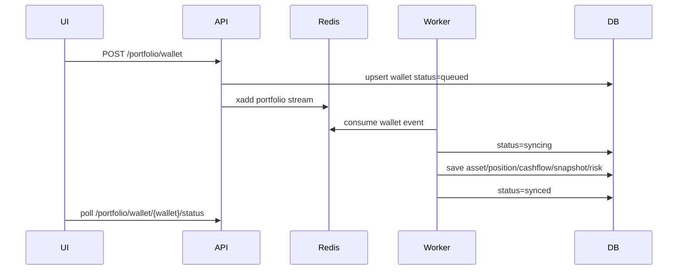
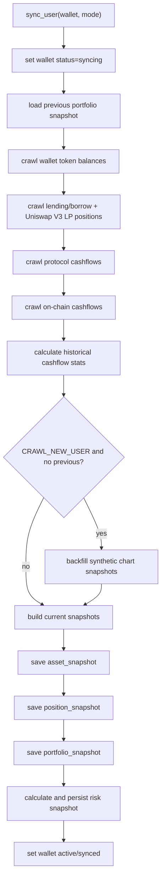
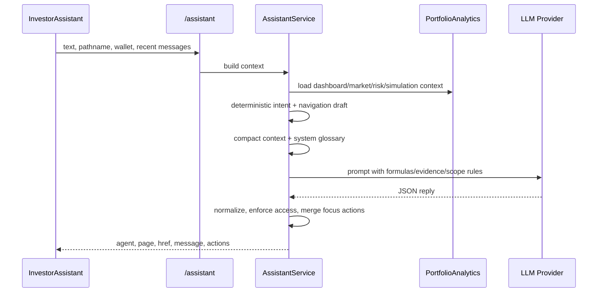
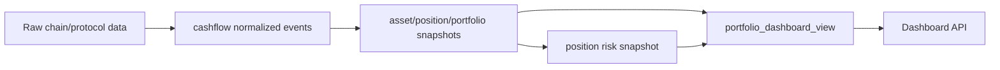

# AI-assisted DeFi Portfolio Analytics and Simulation

## 1. Mục tiêu sản phẩm

Dự án xây dựng hệ thống quản lý, phân tích và mô phỏng danh mục DeFi cho ví người dùng. Hệ thống tập trung vào:

- Tổng hợp tài sản ví, vị thế lending/borrow và vị thế LP.
- Tính net worth, PnL, cost basis, transaction history.
- Theo dõi rủi ro từng vị thế.
- Mô phỏng tác động của các action như buy, swap, lend, borrow, provide liquidity.
- Không đưa ra khuyến nghị đầu tư; hệ thống chỉ cung cấp dữ liệu, phân tích và cảnh báo.

Giao thức hiện tại tập trung vào Aave, Compound và Uniswap. Curve đã bị loại khỏi hướng sản phẩm hiện tại.

## 2. Kiến trúc tổng quan



Các lớp chính:

- `frontend`: dashboard, markets, risk engine, simulator.
- `backend/data_engine`: crawl price, yield, wallet asset, protocol positions, on-chain cashflow.
- `backend/portfolio_engine`: tổng hợp portfolio, analytics, PnL, risk, simulation.
- `backend/portfolio_engine/services/assistant_service.py`: server-side assistant, compact context, prompt LLM, glossary và điều hướng theo focus key.
- `backend/decision_engine`: ranking market bằng AHP.
- `backend/shared/repositories`: repository MongoDB, chuẩn hoá dữ liệu camelCase/snake_case.
- `Redis Stream`: queue sync ví người dùng.

## 3. Luồng user và trạng thái ví

Hệ thống có 2 loại user:

- Guest wallet: vừa connect ví, chưa ghi nhận vào hệ thống. Chỉ dùng được API lấy dữ liệu sẵn nếu có.
- Tracked wallet / Update Plus: user bấm Update Plus, hệ thống add wallet vào queue và crawl đầy đủ dữ liệu.

Luồng add wallet:



CLI liên quan:

```bash
cd backend
python3 run.py portfolio_stream_worker
python3 run.py portfolio_sync_wallet <wallet> --mode SYNC
python3 run.py portfolio_sync_wallet <wallet> --mode CRAWL_NEW_USER
python3 run.py portfolio_reset_wallet <wallet>
python3 run.py portfolio_rebuild_dashboard_view <wallet>
python3 run.py portfolio_recover_stale_syncing
python3 run.py gas_fee_worker
```

## 4. Data Engine

### 4.1 Price data

Price service đọc token support từ DB, chuẩn hoá symbol và lấy giá hiện tại/lịch sử.

Nguyên tắc fallback:

1. Dùng symbol chuẩn hoá, ví dụ `BTC` có thể map về `WBTC` nếu DB chỉ support `WBTC`.
2. Với giá quá khứ, dùng price snapshot gần timestamp giao dịch.
3. Nếu không có snapshot đúng thời điểm, dùng bản ghi gần nhất.
4. Nếu vẫn không có, fallback về current price khi cần hiển thị.

Collection chính:

- `token`
- `price_snapshot`

### 4.2 Yield data

Yield worker crawl market lending và LP:

- Lending: supply APR, borrow APR, stable borrow APR, max LTV, liquidation threshold.
- LP: pool APR, total APR, TVL, token pair, fee tier.

Yield snapshot được lưu để phục vụ:

- Market ranking.
- Risk engine.
- Synthetic portfolio snapshot khi user mới add ví.

Collection chính:

- `yield`
- `yield_snapshot`

### 4.3 Wallet asset

`WalletService.get_wallet_portfolio(wallet)` crawl balance token support của ví, gắn:

- `symbol`
- `balance`
- `price`
- `valueUsd`
- metadata token

Chỉ token support mới nên được đưa vào portfolio analytics chính.

### 4.4 Protocol position

`PortfolioSyncService` lấy vị thế từ các provider:

- Aave V3
- Compound
- Uniswap

Vị thế lending/borrow lưu:

- `protocol`
- `marketId`
- `symbol`
- `side`: `LENDER`, `COLLATERAL`, `BORROWER`
- `balance`
- `valueUsd`
- `supplyApr`
- `borrowApr`
- `maxLtv`
- `liquidationThreshold`

Vị thế LP lưu:

- `type=amm`
- `asset=[token0, token1]`
- `amount0`, `amount1`
- `depositedToken0`, `depositedToken1`
- `withdrawnToken0`, `withdrawnToken1`
- `tickLower`, `tickUpper`
- `feeTier`
- `collectedFeeUsd`

### 4.5 Cashflow và on-chain transactions

`cashflow` là nguồn dữ liệu transaction chính cho UI. Hệ thống không dùng collection riêng `onchain_transactions` nữa.

Cashflow gom cả event protocol và on-chain transaction đã lọc theo token support:

- Protocol events: deposit, withdraw, borrow, repay.
- On-chain token transfer/swap: transfer_in, transfer_out, buy, sell.
- Gas fee và recorded value.

Trường quan trọng:

- `wallet`
- `txId` / `txHash`
- `timestamp`
- `action`
- `symbol`
- `amount`
- `amountUsd`
- `recordedAmountUsd`
- `priceAtTx`
- `priceSource`

`priceAtTx` là giá ước tính tại thời điểm transaction, lấy từ price snapshot gần timestamp. `recordedAmountUsd` là USD value hệ thống/crawler ghi nhận trực tiếp từ transaction/provider. Hai trường này khác nhau:

- `recordedAmountUsd`: giá trị USD được ghi nhận trong event hoặc crawler, có thể là provider-calculated.
- `priceAtTx`: đơn giá token tại thời điểm tx, dùng để tính `amount * priceAtTx`.

Luồng hiện tại:

```text
Etherscan/RPC crawl
-> filter supported token
-> PortfolioSyncService convert row
-> cashflow bulk upsert
-> gas fee worker/backfill cập nhật gasCostEth/gasCostUsd
-> Dashboard Transaction History và PnL Flow đọc từ cashflow
```

### 4.6 Cơ chế crawl, retry và xử lý dữ liệu

Đây là phần lõi của hệ thống vì Dashboard, PnL, Risk Engine và Agent đều phụ thuộc vào chất lượng dữ liệu đã crawl. Hệ thống không chỉ gọi API rồi hiển thị trực tiếp, mà đi qua các bước:

```text
external provider
-> raw response
-> normalize schema
-> filter supported token / supported protocol
-> enrich price, gas, protocol metadata
-> idempotent upsert vào MongoDB
-> build snapshot/read model
-> Dashboard/Agent query dữ liệu đã chuẩn hoá
```

Nguồn dữ liệu chính:

| Nhóm dữ liệu | Nguồn | Cách xử lý |
| --- | --- | --- |
| Token price | CoinGecko + `price_snapshot` | Batch theo token id, cache Redis ngắn hạn, lưu snapshot để tính giá lịch sử. |
| Yield / market | The Graph subgraph | Crawl Aave, Compound, Uniswap; chuẩn hoá APR/APY, TVL, token pair, fee tier. |
| Wallet token hold | RPC/Web3 + token support list | Query balance token support, nhân với giá hiện tại, chỉ đưa token support vào analytics chính. |
| Protocol positions | The Graph providers | Lấy lending, borrow, collateral, Uniswap V3 LP; chuẩn hoá thành `position_snapshot`. |
| On-chain cashflow | Etherscan normal tx + ERC20 transfer | Paginate theo block, lọc token support, phân loại transfer/swap, lưu `txHash`, `logIndex`, `blockNumber`. |
| Gas fee | RPC `eth_getTransactionReceipt` | Tách qua gas fee queue, batch receipt theo tx hash, enrich `gasCostEth` và `gasCostUsd`. |

Cơ chế retry/fallback:

- CoinGecko retry các lỗi `429`, `500`, `502`, `503`, `504`, timeout và network error. Nếu provider trả `Retry-After`, hệ thống ưu tiên delay theo header; nếu không thì exponential backoff.
- The Graph giới hạn concurrency, retry lỗi timeout/rate limit, dedupe các request đang chạy cùng `url + query + variables` để tránh gọi trùng.
- Etherscan retry rate limit, HTTP 5xx, timeout và network error cho cả `txlist`, `tokentx` và `getblocknobytime`.
- Worker định kỳ có retry cấp worker: mỗi lần `process()` lỗi sẽ thử lại tối đa 3 lần trước khi vòng chạy tiếp theo.
- Với môi trường scale nhiều worker, retry nên cộng jitter/random delay nhỏ để tránh nhiều worker gọi lại cùng thời điểm. Phần code hiện tại đã có exponential backoff và cấu hình `delay`; jitter là điểm nên bật khi triển khai production nhiều consumer.

Cơ chế chống dữ liệu sai/trùng:

- `cashflow` dùng unique key theo wallet/tx/action và thêm index `txHash + logIndex` để tránh insert trùng cùng một event.
- On-chain transfer chỉ giữ token support; token không nằm trong whitelist sẽ không được đưa vào portfolio analytics.
- Swap được nhận diện khi cùng một tx có cả dòng incoming và outgoing với token support: incoming thành `buy`, outgoing thành `sell`.
- Protocol cashflow được ưu tiên cho deposit/withdraw/borrow/repay; các shadow transfer on-chain cùng tx có thể bị loại khỏi token cost basis để tránh tính nhầm deposit là giao dịch mua/bán.
- `recordedAmountUsd` và `priceAtTx` được tách riêng. Nếu không có giá đúng timestamp, hệ thống dùng snapshot gần timestamp hoặc fallback an toàn hơn thay vì coi giá bằng `0`.
- Các dòng PnL có độ tin cậy thấp được đánh dấu `pnlReliable=false` và UI chỉ hiển thị tooltip giải thích, không ép tính ra số sai.

### 4.7 Queue và tối ưu throughput

Hệ thống dùng Redis Stream để tách request của user khỏi quá trình crawl nặng:

```text
POST /portfolio/wallet
-> wallet status = queued
-> XADD portfolio:user-sync
-> UserPortfolioStreamWorker consume
-> PortfolioSyncService.sync_user
-> wallet status = syncing/synced/failed
```

Lợi ích:

- API trả nhanh cho người dùng, UI chỉ cần poll status.
- Worker xử lý ví theo hàng đợi, có thể scale thêm consumer khi dữ liệu tăng.
- Redis consumer group chỉ `XACK` sau khi xử lý thành công; event lỗi được log lại để có thể kiểm tra và chạy lại.
- Trạng thái ví (`guest`, `queued`, `syncing`, `synced`, `failed`) giúp frontend biết nên hiển thị preview, loading hay dashboard đầy đủ.

Gas fee cũng dùng queue riêng:

```text
cashflow tx hashes
-> XADD portfolio:gas-fee
-> GasFeeStreamService collect batch
-> eth_getTransactionReceipt batch RPC
-> update cashflow gasCostEth/gasCostUsd
```

Nhờ tách gas fee khỏi sync chính, dashboard có thể có dữ liệu portfolio trước, còn gas fee được enrich dần theo batch. Cách này giảm latency của lần crawl đầu và tránh làm nghẽn provider RPC.

## 5. Portfolio Sync Flow

Luồng chính nằm trong `PortfolioSyncService.sync_user`.



### 5.1 Current snapshot

Mỗi lần sync tạo:

- `asset_snapshot`: token hold hiện tại.
- `position_snapshot`: lending/borrow/LP hiện tại.
- `portfolio_snapshot`: tổng hợp toàn ví.
- `position_risk_snapshot`: risk snapshot.

### 5.2 Initial cashflow lookback và synthetic backfill

Khi wallet mới add bằng `CRAWL_NEW_USER`, hệ thống không crawl toàn bộ lịch sử ví ngay lập tức. Thay vào đó, `PortfolioSyncService` đặt `last_sync_ts = now - INITIAL_CASHFLOW_LOOKBACK_DAYS`.

Giá trị mặc định:

```text
INITIAL_CASHFLOW_LOOKBACK_DAYS=180
```

Ý nghĩa:

- Giảm thời gian crawl lần đầu so với việc quét toàn bộ lịch sử ví.
- Vẫn đủ rộng để xem lại phần lớn cashflow gần đây, kiểm tra PnL, lending/borrow flow và transaction evidence.
- Có thể chỉnh bằng biến môi trường nếu muốn crawl ngắn hơn/dài hơn.

Nếu chưa có previous snapshot, hệ thống vẫn tạo một số daily synthetic snapshots cho chart history ban đầu.

Dữ liệu dùng:

- Balance hiện tại.
- Cashflow đã crawl.
- Historical price snapshot.
- Historical yield snapshot.

Ý nghĩa:

- UI có net worth history ngay sau khi add wallet.
- Đây là approximation, không phải historical truth tuyệt đối.
- Cashflow evidence và PnL đáng tin hơn khi dữ liệu trong 180 ngày đủ phủ các deposit/withdraw/borrow/repay chính.

Cách dựng balance quá khứ:

- Với token hold, đi ngược từ balance hiện tại và đảo chiều các cashflow sau timestamp snapshot.
- Với lending collateral:
  - Deposit sau snapshot làm giảm balance quá khứ.
  - Withdraw sau snapshot làm tăng balance quá khứ.
- Với borrow:
  - Borrow sau snapshot làm giảm debt quá khứ.
  - Repay sau snapshot làm tăng debt quá khứ.

## 6. Công thức Portfolio

### 6.1 Token hold

Với mỗi asset:

```text
assetValueUsd = balance * price
assetPnlUsd = currentValueUsd - previousValueUsd
assetPnlPct = assetPnlUsd / previousValueUsd * 100
```

Tổng token hold:

```text
tokenHoldUsd = sum(assetValueUsd)
tokenHoldPnlUsd = sum(assetPnlUsd)
```

### 6.2 Position value

Lending/collateral:

```text
totalSupplyUsd = sum(valueUsd where side in LENDER, COLLATERAL and type != amm)
```

Borrow:

```text
totalBorrowUsd = sum(valueUsd where side == BORROWER and type != amm)
```

AMM/LP:

```text
totalAmmUsd = sum(valueUsd where type == amm)
```

Collateral:

```text
collateralUsd = sum(valueUsd where isCollateral == true)
```

### 6.3 Principal và interest

Từ cashflow:

```text
supplyPrincipalUsd = depositUsd - withdrawUsd
borrowPrincipalUsd = borrowUsd - repayUsd
supplyInterestUsd = totalSupplyUsd - supplyPrincipalUsd
borrowInterestUsd = totalBorrowUsd - borrowPrincipalUsd
netInterestUsd = supplyInterestUsd - borrowInterestUsd
```

### 6.4 Net worth

Công thức sản phẩm:

```text
netWorthUsd = tokenHoldUsd + supplyPrincipalUsd + totalAmmUsd + supplyInterestUsd - totalBorrowUsd
```

Tương đương:

```text
netWorthUsd = tokenHoldUsd + totalSupplyUsd + totalAmmUsd - totalBorrowUsd
```

trong trường hợp `totalSupplyUsd = supplyPrincipalUsd + supplyInterestUsd`.

### 6.5 Total PnL theo snapshot

```text
netExternalFlowUsd = externalDepositUsd - externalWithdrawUsd
totalPnlUsd = currentNetWorthUsd - previousNetWorthUsd - netExternalFlowUsd
```

Nếu chưa có previous snapshot:

```text
totalPnlUsd = 0
```

### 6.6 Dashboard PnL period

```text
periodUsd = currentNetWorthUsd - referenceNetWorthUsd - netExternalFlowUsd
netExternalFlowUsd = externalDepositUsd - externalWithdrawUsd
```

```text
periodPct = deltaUsd / referenceNetWorthUsd * 100
roiPct = allTimePct
```

Trong đó `referenceNetWorthUsd` là snapshot tại hoặc trước mốc bắt đầu kỳ:

- Today: snapshot tại hoặc trước `now - 1 day`.
- 7 Days: snapshot tại hoặc trước `now - 7 days`.
- All Time: snapshot đầu tiên đã lưu.

Lý do trừ `netExternalFlowUsd`: tiền user nạp thêm vào ví không phải lợi nhuận, tiền rút ra khỏi ví không phải khoản lỗ đầu tư.

### 6.7 Cost basis và transaction PnL

Transaction feed dùng average cost theo symbol.

Khi inflow:

```text
basis[symbol] += amount * priceAtTx
amountHold[symbol] += amount
```

Khi outflow/sell/withdraw/borrow:

```text
avgCost = basis[symbol] / amountHold[symbol]
consumed = min(txAmount, amountHold[symbol])
cost = avgCost * consumed
realizedPnl = txValueUsd - cost
basis[symbol] -= cost
amountHold[symbol] -= consumed
```

Với transfer out, realized PnL đang được set `0` để tránh hiểu nhầm transfer là trade.

Hold position PnL:

```text
unrealizedPnlUsd = currentValueUsd - costBasisUsd + realizedPnlUsd
pnlPct = unrealizedPnlUsd / costBasisUsd * 100
entryPrice = costBasisUsd / balance
```

## 7. Risk Engine

Risk engine nằm trong `PositionRiskService`.

### 7.1 Lending risk

Lending context:

```text
weightedCollateralUsd = sum(collateralValueUsd * liquidationThreshold)
debtUsd = sum(borrowPositionValueUsd)
healthFactor = weightedCollateralUsd / debtUsd
liquidationBufferUsd = weightedCollateralUsd - debtUsd
```

Nếu không có debt:

```text
healthFactor = 999
```

Price move to liquidation với collateral:

```text
collateralContribution = positionValueUsd * liquidationThreshold
priceMoveToLiquidationPct = (weightedCollateralUsd - debtUsd) / collateralContribution * 100
```

Price move to liquidation với borrowed asset:

```text
priceMoveToLiquidationPct = (weightedCollateralUsd / debtUsd - 1) * (debtUsd / borrowedAssetValueUsd) * 100
```

Forecast liquidation probability:

```text
volatility7d = volatility30d * sqrt(7)
z = (thresholdMove - forecast7dPct) / volatility7d
probability = normalCdf(z) or 1 - normalCdf(z)
```

Collateral side dùng downside threshold. Borrow side dùng upside threshold.

Risk score lending bắt đầu từ `12`, cộng điểm theo:

- thiếu liquidation threshold
- health factor thấp
- buffer mỏng
- trend bất lợi
- forecast probability cao
- volatility cao

Risk level:

```text
score >= 85 => CRITICAL
score >= 65 => HIGH
score >= 40 => MEDIUM
else LOW
```

### 7.2 Price trend model

Risk engine lấy price history tối đa 30 ngày.

Return:

```text
logReturn[i] = ln(price[i] / price[i-1])
volatility30dPct = populationStdDev(logReturn) * 100
change7dPct = (currentPrice - price7dAgo) / price7dAgo * 100
change30dPct = (currentPrice - firstPrice) / firstPrice * 100
maxDrawdown30dPct = (currentPrice - maxPrice) / maxPrice * 100
```

Forecast dùng EMA-weighted linear regression trên log price:

```text
y = ln(EMA(price))
slope = weightedCovariance(dayIndex, y) / weightedVariance(dayIndex)
forecast1dPct = (exp(slope) - 1) * 100
regression7dPct = (exp(slope * 7) - 1) * 100
forecast7dPct = 0.7 * regression7dPct + 0.3 * emaMomentum7dPct
confidence = 1 / (1 + 12 * residualStd)
```

Trend:

```text
noiseBand = max(atr14dPct * sqrt(7), volatility30dPct * sqrt(7), 1.5)
UP if forecast7dPct > noiseBand
DOWN if forecast7dPct < -noiseBand
else FLAT
```

### 7.3 LP risk

LP risk gồm:

- Impermanent loss.
- Range risk.
- Forecast out of range.
- Volatility cặp token.

Hold value:

```text
holdValueUsd =
    max(depositedToken0 - withdrawnToken0, 0) * price0
  + max(depositedToken1 - withdrawnToken1, 0) * price1
```

Current LP value:

```text
currentValueUsd = valueUsd or amount0 * price0 + amount1 * price1
```

Impermanent loss:

```text
impermanentLossUsd = currentValueUsd + collectedFeeUsd - holdValueUsd
impermanentLossPct = impermanentLossUsd / holdValueUsd * 100
```

Uniswap tick:

```text
currentRatio = price0 / price1 * 10^(token0Decimals - token1Decimals)
currentTick = ln(currentRatio) / ln(1.0001)
inRange = priceLower <= currentRatio <= priceUpper
distanceToRangeEdgePct = min(abs(currentTick - tickLower), abs(tickUpper - currentTick)) / (tickUpper - tickLower) * 100
```

Forecast range:

```text
ratioChange = (1 + token0Forecast7dPct / 100) / (1 + token1Forecast7dPct / 100)
forecastRatio = currentRatio * ratioChange
forecastTick7d = ln(forecastRatio) / ln(1.0001)
projectedLow/HighTick7d = forecastTick7d +/- pair ATR band
forecastOutOfRange = forecastTick7d hoặc projected tick vượt khỏi [tickLower, tickUpper]
```

Forecast IL:

```text
projectedPrice0 = price0 * (1 + token0Forecast7dPct / 100)
projectedPrice1 = price1 * (1 + token1Forecast7dPct / 100)
projectedLpValueUsd = v3Amount0(projectedRatio) * projectedPrice0
                    + v3Amount1(projectedRatio) * projectedPrice1
                    + collectedFeeUsd
forecastIlUsd = projectedLpValueUsd - projectedHoldValueUsd
forecastIlPct = forecastIlUsd / projectedHoldValueUsd * 100
```

LP score bắt đầu từ `14`, cộng điểm theo:

- out of range
- gần boundary
- forecast out of range
- IL hiện tại đáng kể
- forecast IL đáng kể
- volatility cao

### 7.4 Portfolio risk aggregate

```text
totalRiskValueUsd = sum(abs(positionValueUsd))
riskScore = sum(positionRiskScore * abs(positionValueUsd)) / totalRiskValueUsd
highRiskValueUsd = sum(abs(valueUsd) where level in HIGH, CRITICAL)
highRiskRatio = highRiskValueUsd / totalRiskValueUsd
```

## 8. Simulation Engine

Simulation chạy qua:

```http
POST /simulation/{wallet}
```

Payload hỗ trợ:

- `price_shock`
- `lend`
- `stake`
- `borrow`
- `swap`
- `provide_liquidity`

### 8.1 Base summary

Trước simulation:

```text
tokenHoldUsd = latest.tokenHoldUsd or sum(asset.valueUsd)
positionUsd = totalSupplyUsd + totalAmmUsd
borrowUsd = totalBorrowUsd
netWorthUsd = tokenHoldUsd + positionUsd - borrowUsd
```

### 8.2 Fee model

Fee model dùng cashflow on-chain:

```text
gasBase = medianGasUsd or avgGasUsd or defaultSwapGas
```

Default:

```text
swap = 8
lend = 6
stake = 6
borrow = 9
addLiquidity = 14
priceShock = 0
```

Derived:

```text
lendGas = max(gasBase * 0.75, 6)
borrowGas = max(gasBase, 9)
addLiquidityGas = max(gasBase * 1.8, 14)
swapProtocolFeePct = 0.3
```

### 8.3 Price shock

```text
tokenDeltaUsd = assetValueUsd * shockPct / 100
positionDeltaUsd = positionValueUsd * avgMatchedTokenShockPct / 100
borrowDeltaUsd = borrowValueUsd * matchedShockPct / 100
```

```text
afterTokenHoldUsd = beforeTokenHoldUsd + tokenDeltaUsd
afterPositionUsd = beforePositionUsd + positionDeltaUsd
afterBorrowUsd = beforeBorrowUsd + borrowDeltaUsd
afterNetWorthUsd = afterTokenHoldUsd + afterPositionUsd - afterBorrowUsd
```

### 8.4 Lend / Stake

```text
valueUsd = amount * tokenPrice
gas = payload.gasUsd or feeModel.gas[action]
annualIncomeUsd = valueUsd * supplyApr / 100
```

```text
afterTokenHoldUsd = beforeTokenHoldUsd - min(valueUsd, walletTokenValueUsd)
afterPositionUsd = beforePositionUsd + valueUsd
afterNetWorthUsd = afterTokenHoldUsd + afterPositionUsd - beforeBorrowUsd - gas
```

### 8.5 Borrow

```text
valueUsd = amount * tokenPrice
gas = payload.gasUsd or feeModel.gas.borrow
annualBorrowCostUsd = valueUsd * borrowApr / 100
stressedDebtUsd = valueUsd * max(1 + shockPct / 100, 0)
```

```text
afterTokenHoldUsd = beforeTokenHoldUsd + max(valueUsd - gas, 0)
afterBorrowUsd = beforeBorrowUsd + valueUsd
afterNetWorthUsd = afterTokenHoldUsd + beforePositionUsd - afterBorrowUsd
```

### 8.6 Swap / Buy token

Buy token trên UI hiện được mô phỏng bằng payload `swap`.

```text
valueUsd = amountFrom * fromPrice
totalTradeFeePct = slippagePct + protocolFeePct
receivedValueUsd = valueUsd * (1 - totalTradeFeePct / 100)
receivedAmount = receivedValueUsd / toPrice
gas = payload.gasUsd or feeModel.gas.swap
```

```text
afterTokenHoldUsd =
    beforeTokenHoldUsd
  + receivedValueUsd
  - min(valueUsd, walletFromTokenValueUsd)
  - gas

afterNetWorthUsd = afterTokenHoldUsd + beforePositionUsd - beforeBorrowUsd
```

### 8.7 Provide liquidity

```text
value0 = amount0 * price0
value1 = amount1 * price1 if amount1 > 0 else value0
positionValueUsd = value0 + value1
gas = payload.gasUsd or feeModel.gas.addLiquidity
```

IL:

```text
ratio = max(1 + shockPct / 100, 0.0001)
ilPct = (2 * sqrt(ratio) / (1 + ratio) - 1) * 100
ilUsd = positionValueUsd * ilPct / 100
```

Projected fee:

```text
projectedAnnualFeeIncomeUsd = positionValueUsd * apr / 100
```

After:

```text
afterTokenHoldUsd =
    beforeTokenHoldUsd
  - min(value0, walletToken0ValueUsd)
  - min(value1, walletToken1ValueUsd)

afterPositionUsd = beforePositionUsd + positionValueUsd
afterNetWorthUsd = afterTokenHoldUsd + afterPositionUsd - beforeBorrowUsd - gas
```

## 9. Market Ranking / AHP

Endpoint:

```http
GET /yields?profile=balanced&limit=100
GET /yields?yield_weight=0.4&safety_weight=0.4&efficiency_weight=0.2
```

Mục tiêu:

- Cho nhà đầu tư xem market lending/LP theo nhóm chỉ số dễ hiểu.
- Không gọi API mỗi lần kéo slider; UI chỉ gọi lại khi user Apply.

Nhóm chỉ số:

- Yield: APR/APY/current return.
- Safety: TVL, protocol, liquidation threshold, volatility/risk-related metrics nếu có.
- Efficiency: capital efficiency, borrow/supply relation, fee/TVL.

AHP tổng quát:

```text
score = normalizedYield * yieldWeight
      + normalizedSafety * safetyWeight
      + normalizedEfficiency * efficiencyWeight
```

Trọng số có thể theo preset hoặc custom. Tổng weight nên được normalize về 1.

## 10. AI Assistant và LLM layer

AI trong hệ thống đóng vai trò trợ lý giải thích, điều hướng và hỗ trợ mô phỏng. AI không thay thế các engine tính toán deterministic. Tất cả số liệu tài chính quan trọng như net worth, PnL, cost basis, risk score và simulation result vẫn được tính bởi backend service trước, sau đó AI chỉ đọc context đã chuẩn hoá để giải thích cho người dùng.

### 10.1 Vai trò của AI Assistant

Assistant hỗ trợ các nhóm tác vụ:

- Giải thích Dashboard: net worth, PnL period, PnL by category, cost basis, ROI, allocation, holdings table và cashflow feed.
- Giải thích Market: APR/APY, TVL, protocol, token pair, pool, market ranking và AHP score.
- Giải thích Risk Engine: health factor, liquidation risk, collateral exposure, borrow exposure, price trend, impermanent loss.
- Hỗ trợ Simulator: hiểu intent người dùng như buy/swap/lend/borrow/provide liquidity/price shock và mở đúng màn hình với tham số đã điền trước.
- Điều hướng UI: trả về `href` kèm `agentFocus` và `focusLabel` để frontend highlight đúng vùng dữ liệu.
- Trả lời glossary cơ bản trong phạm vi hệ thống: ROI, PnL, cost basis, APR, APY, TVL, LTV, liquidation, slippage, LP, cashflow.

Ràng buộc quan trọng:

- Không đưa ra lời khuyên đầu tư cá nhân.
- Không tự bịa dữ liệu ngoài context backend cung cấp.
- Không gọi web/browse từ agent runtime.
- Guest wallet chỉ được hỏi Dashboard preview và Markets; Risk Engine/Simulator yêu cầu Update Plus.
- Câu trả lời phải ưu tiên công thức, số liệu và evidence tx hash khi câu hỏi liên quan đến PnL/cashflow.

### 10.2 Kiến trúc LLM orchestration

Luồng `/assistant`:



`AssistantService` luôn tạo một deterministic draft trước khi gọi LLM. Draft này gồm:

- Trang phù hợp: dashboard, markets, risk-engine hoặc simulator.
- Intent sơ bộ: hỏi giá, hỏi PnL, hỏi risk, tạo simulation draft, hỏi khái niệm.
- Focus key để UI highlight đúng vùng.
- Action gợi ý như “Open PnL”, “Open Cashflow”, “Open Simulator”.

LLM được dùng để viết câu trả lời tự nhiên hơn, nhưng output vẫn bị normalize về schema:

```json
{
  "agent": "Dashboard Agent",
  "page": "dashboard",
  "href": "/dashboard?agentFocus=dashboard:pnl",
  "message": "...",
  "actions": [
    {"label": "Open PnL", "href": "/dashboard?agentFocus=dashboard:pnl", "primary": true}
  ]
}
```

Nếu LLM lỗi, quota hết hoặc trả JSON không hợp lệ, hệ thống vẫn có thể fallback về deterministic reply để không làm hỏng UX.

### 10.3 Context grounding cho Dashboard Agent

Dashboard Agent không nhận toàn bộ database. Backend compact context theo hướng chỉ đưa dữ liệu cần thiết:

- `netWorth`, `pnlSummary`, `positionsPnL`.
- Top positions theo value.
- Recent transactions/cashflow có `txHash`, `explorerUrl`, `amountUsd`, `priceAtTx`.
- PnL flows theo pool/market.
- Risk summary nếu đang ở context risk.
- Market list đã rút gọn.
- `dashboardGuide`: công thức chuẩn của hệ thống.
- `systemGlossary`: định nghĩa các khái niệm xuất hiện trong UI.

Khi user hỏi PnL, prompt bắt buộc agent:

- Nêu công thức trước.
- Chỉ dùng row có `pnlReliable=true`.
- Liệt kê largest contributing positions.
- Liệt kê tối đa 5 tx/flow liên quan, có markdown link theo tx hash nếu có `explorerUrl`.
- Nếu không có tx hash trong dữ liệu hiện tại, nói rõ là chưa có evidence hash, không tự tạo hash.

Ví dụ với Token Hold PnL:

```text
Token Hold PnL = sum(current value - remaining average-cost basis + realized sell PnL)
```

Các token có transfer-in/withdraw/borrow inflow mà không xác định được cost basis sẽ không bị ép tính PnL. UI vẫn hiển thị current value, còn PnL/ROI được ẩn hoặc giải thích bằng tooltip.

### 10.4 LLM provider và đối chiếu source code

Trong source code hiện tại có hai luồng AI khác nhau, không nên gộp chung thành một provider duy nhất:

- Dashboard/Market/Risk/Simulator chat dùng `AssistantService` tại `backend/portfolio_engine/services/assistant_service.py`.
- Natural-language simulator intent parser dùng `NLPIntentExtractor` tại `backend/portfolio_engine/ai_agent/intent_extractor.py`.

`AssistantService` là luồng được gọi bởi endpoint `POST /assistant`. Luồng này tạo deterministic draft trước, build context từ dashboard/risk/market data, sau đó gọi Google AI Studio nếu có key. Các biến thật sự được dùng trong luồng chat assistant:

| Biến | Nơi dùng | Vai trò |
| --- | --- | --- |
| `GOOGLE_AI_STUDIO_API_KEY` / `GEMINI_API_KEY` / `GOOGLE_API_KEY` | `AssistantService._google_reply` | API key gọi Gemini qua Google AI Studio. |
| `GOOGLE_AI_MODEL` | `AssistantService._google_reply` | Tên model Gemini, mặc định `gemini-2.5-flash`. |
| `ASSISTANT_DEFAULT_LANGUAGE` | `AssistantService._build_prompt` | Ngôn ngữ mặc định, prompt vẫn ưu tiên ngôn ngữ user đang dùng. |

`OPENAI_API_KEY`, `OPENAI_MODEL` và `OPENAI_BASE_URL` không được luồng Dashboard Assistant chính sử dụng. Chúng thuộc luồng parse intent cho Simulator:

| Biến | Nơi dùng | Vai trò |
| --- | --- | --- |
| `OPENAI_API_KEY` | `NLPIntentExtractor._extract_with_ai` | Gọi OpenAI-compatible chat completions để parse lệnh mô phỏng. |
| `OPENAI_MODEL` | `NLPIntentExtractor._extract_with_ai` | Model dùng cho structured JSON intent. Nếu thiếu model, parser tự fallback rule-based. |
| `OPENAI_BASE_URL` | `NLPIntentExtractor._extract_with_ai` | Base URL OpenAI-compatible, mặc định `https://api.openai.com/v1`. |
| `INTENT_PROVIDER` | `NLPIntentExtractor._extract_with_ai` | `rules` buộc dùng rule parser; giá trị khác cho phép thử AI parser nếu có key/model. |

Điểm cần lưu ý khi vận hành:

- Nếu không cấu hình Google AI Studio, `/assistant` vẫn trả lời bằng deterministic fallback nhưng provider trả về là `default`.
- Nếu không cấu hình OpenAI-compatible, Simulator vẫn parse intent bằng rule-based specs.
- Vì vậy không nên mô tả `OPENAI_*` là provider thay thế trực tiếp cho Dashboard Assistant ở phiên bản hiện tại.
- `backend/env.example` ưu tiên biến Google cho Assistant, còn `OPENAI_*` chỉ là cấu hình tùy chọn cho Simulator intent parser.

### 10.5 Vì sao AI là điểm mạnh của hệ thống

Điểm mạnh không nằm ở việc “AI tự đoán số”, mà ở chỗ AI được nối với dữ liệu đã crawl và công thức đã kiểm soát:

- Người dùng không chỉ thấy một con số PnL, mà có thể hỏi vì sao ra con số đó.
- Agent có thể chỉ ra công thức, dòng position và transaction evidence.
- Agent giúp user chuyển từ câu hỏi tự nhiên sang đúng màn dashboard/market/risk/simulator.
- Các khái niệm tài chính trong UI được giải thích ngay tại ngữ cảnh, giảm việc user hiểu nhầm ROI, PnL, cost basis hoặc borrow cost.
- Scope và access control giúp guest user không truy cập nhầm các tính năng cần Update Plus.

## 11. Frontend

Các page chính:

- `/dashboard`: net worth, allocation, holdings + positions, transaction history.
- `/markets`: asset overview, token chart, yield ranking, AHP model.
- `/risk-engine`: risk theo từng vị thế.
- `/simulator`: action simulator.

### 11.1 Dashboard

Dashboard hiển thị:

- Net worth banner.
- Net worth history.
- Donut allocation.
- Portfolio holdings: token hold + lending/borrow/LP positions.
- Transaction history.
- Update Plus panel khi ví chưa được tracked.

### 11.2 Simulator UX

Simulator hiện chia 60/40:

- 60% trái: environment, wallet context, configure draft.
- 40% phải: scenario actions + simulation result.

Action queue cập nhật context tạm tính ở frontend:

- Swap/buy: trừ token bán, cộng token nhận nếu có price.
- Lend/loop/LP: trừ token dùng làm collateral/liquidity.
- Feasibility check dựa trên context sau các action đã queue, không chỉ snapshot ban đầu.

Lưu ý: backend hiện simulate từng payload một lần. Queue ở frontend đang là UX layer; chưa có batch simulation aggregate backend.

## 12. Data pipeline và query optimization

Hệ thống dùng hướng materialized read model để tránh API dashboard phải đọc nhiều collection lớn và tính lại mỗi lần request.

Pipeline tối ưu:



### 12.1 Dashboard read model

Collection:

```text
portfolio_dashboard_view
```

Mỗi document:

```ts
{
  wallet: string,
  sourceTimestamp: number,
  schemaVersion: number,
  payload: {
    netWorth,
    pnlSummary,
    positionsPnL,
    transactions,
    transactionPoolGroups,
    chartHistory
  },
  updatedAt,
  createdAt
}
```

Dashboard API flow:

```text
GET /portfolio/analytics/{wallet}
  -> get latest portfolio_snapshot timestamp
  -> read portfolio_dashboard_view
  -> if sourceTimestamp and schemaVersion match latest snapshot, return payload
  -> else rebuild view and upsert
```

Sau khi `PortfolioSyncService.sync_user` lưu snapshot xong, service gọi:

```text
PortfolioAnalyticsService.refresh_dashboard_view(wallet)
```

Nhờ vậy, request dashboard bình thường chỉ đọc:

```text
portfolio_snapshot latest timestamp + portfolio_dashboard_view
```

thay vì tính lại:

- net worth
- PnL period
- positions PnL
- transaction feed
- chart history

`transactionPoolGroups` gom transaction theo market/pool/source để UI hiển thị người dùng đang take profit hay đang lỗ ở từng pool.

Mỗi group gồm:

```ts
{
  poolKey,
  poolLabel,
  protocol,
  symbols,
  transactionCount,
  inflowUsd,
  outflowUsd,
  netFlowUsd,
  realizedPnlUsd,
  gasUsd,
  status: "take_profit" | "loss" | "neutral"
}
```

### 12.2 Indexes quan trọng

Indexes hiện có/được bổ sung:

```js
portfolio_snapshot:       { wallet: 1, timestamp: -1 }
portfolio_dashboard_view: { wallet: 1 } unique
portfolio_dashboard_view: { wallet: 1, sourceTimestamp: -1 }
asset_snapshot:           { wallet: 1, symbol: 1, timestamp: -1 }
asset_snapshot:           { wallet: 1, timestamp: -1 }
position_snapshot:        { wallet: 1, positionId: 1, timestamp: -1 }
position_snapshot:        { wallet: 1, timestamp: -1 }
cashflow:                 { wallet: 1, txId: 1, action: 1 } unique
cashflow:                 { wallet: 1, timestamp: -1 }
cashflow:                 { wallet: 1, symbol: 1, timestamp: -1 }
cashflow:                 { wallet: 1, eventSource: 1, blockNumber: -1 }
cashflow:                 { wallet: 1, txHash: 1, logIndex: 1 }
cashflow:                 { positionId: 1, timestamp: -1 }
token_price_snapshots:    { coingeckoId: 1, timestamp: 1 }
token_price_snapshots:    { coingeckoId: 1, timestamp: -1 }
```

### 12.3 Vận hành read model

Rebuild thủ công cho một ví:

```bash
cd backend
python3 run.py portfolio_rebuild_dashboard_view <wallet>
```

Khi reset ví:

```bash
python3 run.py portfolio_reset_wallet <wallet>
```

lệnh này xoá cả derived collections và `portfolio_dashboard_view`, tránh cache cũ.

### 12.4 Những điểm vẫn cần tối ưu tiếp

Các phần còn nặng nếu dữ liệu tăng lớn:

- `GET /portfolio/analytics/{wallet}/transactions` vẫn tính cost basis từ toàn bộ cashflow khi không đọc từ read model riêng.
- `positions-pnl` vẫn có thể tính lại cost basis theo symbol.
- Risk engine vẫn tính theo latest positions và price history khi gọi trực tiếp.

Hướng tiếp theo:

- Tạo `portfolio_transaction_feed_view` để transaction API đọc phân trang theo cursor.
- Tạo `portfolio_positions_pnl_view`.
- Tạo `wallet_sync_checkpoint` theo block/timestamp để sync incremental rõ ràng hơn.
- Tách `ReadModelWorker` riêng thay vì refresh đồng bộ trong sync service nếu sync latency quá cao.

## 13. API chính

Portfolio:

```http
POST /portfolio/wallet
GET /portfolio/wallet/{wallet}/status
GET /portfolio/{wallet}
GET /portfolio/positions/{wallet}
```

Analytics:

```http
GET /portfolio/analytics/{wallet}
GET /portfolio/analytics/{wallet}/transactions?limit=100
GET /portfolio/analytics/{wallet}/positions-pnl
GET /portfolio/analytics/{wallet}/history?limit=90
GET /portfolio/analytics/{wallet}/risk
GET /portfolio/analytics/{wallet}/risk/history?limit=90
```

Yield:

```http
GET /yields
```

Simulation:

```http
POST /simulation/{wallet}
POST /simulation/intent/parse
```

Assistant:

```http
POST /assistant
```

Payload chính:

```ts
{
  text: string,
  pathname: string,
  wallet?: string,
  messages: Array<{ role: "user" | "assistant", text: string, agent?: string }>
}
```

Response chính:

```ts
{
  provider: "google-ai-studio" | "default",
  model?: string,
  reply: {
    agent: string,
    page: "dashboard" | "markets" | "risk-engine" | "simulator",
    href: string,
    message: string,
    actions: Array<{ label: string, href: string, primary?: boolean }>
  }
}
```

## 14. MongoDB collections

Các collection chính:

- `wallets`: trạng thái wallet, active/synced.
- `token`: token support.
- `price_snapshot`: lịch sử giá token.
- `yield`: market hiện tại.
- `yield_snapshot`: lịch sử market/yield.
- `asset_snapshot`: snapshot token hold theo wallet.
- `position_snapshot`: snapshot position lending/borrow/LP.
- `portfolio_snapshot`: snapshot tổng hợp portfolio.
- `cashflow`: transaction/cashflow đã chuẩn hoá.
- `position_risk_snapshot`: risk snapshot portfolio và từng position.
- `portfolio_dashboard_view`: read model dashboard đã precompute.

Chuẩn đặt tên mới nên dùng camelCase ở API/UI. Repository có lớp chuyển đổi để làm việc với dữ liệu cũ/snake_case khi cần.

## 15. Công thức và giả định cần kiểm chứng

Các phần dưới đây đang là approximation hoặc cần review kỹ hơn trước khi coi là chuẩn tài chính.

### 15.1 Initial cashflow lookback và synthetic backfill

Initial cashflow lookback mặc định là 180 ngày qua `INITIAL_CASHFLOW_LOOKBACK_DAYS`. Các synthetic daily snapshots ban đầu được dựng từ current balance + cashflow trong cửa sổ đã crawl + historical price/yield. Nếu cashflow thiếu hoặc crawler không thấy đủ transfer/protocol event, snapshot quá khứ có thể lệch.

### 15.2 Supply interest và borrow interest

```text
supplyInterestUsd = totalSupplyUsd - supplyPrincipalUsd
borrowInterestUsd = totalBorrowUsd - borrowPrincipalUsd
```

Công thức này phụ thuộc cashflow đầy đủ. Nếu thiếu deposit/withdraw/borrow/repay lịch sử, interest có thể sai.

### 15.3 Position PnL theo previous snapshot

```text
positionPnlUsd = currentValueUsd - previousValueUsd
```

Đây là PnL theo snapshot gần nhất, không phải full realized/unrealized PnL chuẩn kế toán.

### 15.4 LP impermanent loss

Risk engine dùng deposited/withdrawn và current LP value để ước tính IL. Simulation dùng công thức 50/50 constant-product.

Cần kiểm chứng nếu:

- Uniswap V3 concentrated liquidity không phải full-range 50/50.
- Fee tier và liquidity range làm tỷ trọng token thay đổi.
- Position có nhiều lần add/remove liquidity.

### 15.5 LP range tick

```text
currentTick = ln(priceRatio) / ln(1.0001)
```

Cần đảm bảo `priceRatio` đúng chiều token0/token1 theo Uniswap pool. Nếu đảo chiều token, range risk sẽ sai.

### 15.6 Borrow simulation

Borrow simulation hiện chưa tính health factor chính xác sau khi borrow dựa trên toàn bộ collateral threshold. Nó chỉ cảnh báo nếu không có collateral và tính debt stress theo borrowed token.

### 15.7 Swap simulation

Swap dùng:

```text
totalTradeFeePct = slippagePct + protocolFeePct
```

Chưa tính:

- real route
- pool liquidity
- price impact động
- MEV
- exact Uniswap quote

### 15.8 Risk forecast

Forecast dùng linear regression trên log price 30 ngày. Đây là mô hình thống kê nhẹ, không phải ML/AI phức tạp. Phù hợp để cảnh báo xu hướng và volatility, không phù hợp để dự báo giá chính xác.

## 16. Hướng nâng cấp tiếp theo

Ưu tiên kỹ thuật:

1. Batch simulation backend: nhận danh sách action và trả về state sau từng action.
2. Health factor simulation sau borrow/lend/loop dựa trên toàn bộ collateral/debt.
3. Uniswap quote thật qua router/quoter để tính swap fee, price impact và LP input ratio.
4. LP risk theo Uniswap V3 exact math thay vì approximation 50/50.
5. Chuẩn hoá hoàn toàn camelCase ở DB layer và migration dữ liệu cũ.
6. Thêm test cho công thức net worth, cashflow basis, risk, simulation.
7. Mở rộng NLP intent như helper nhập liệu, nhưng không thay thế form simulation.

Ưu tiên sản phẩm:

1. Giải thích nguồn dữ liệu và độ tin cậy trên UI.
2. Gắn tag `estimated`, `observed`, `synthetic` cho snapshot/transaction.
3. Cho phép user so sánh nhiều scenario.
4. Tách risk engine thành module chuyên sâu riêng.
5. Thêm report export cho portfolio/risk/simulation.
