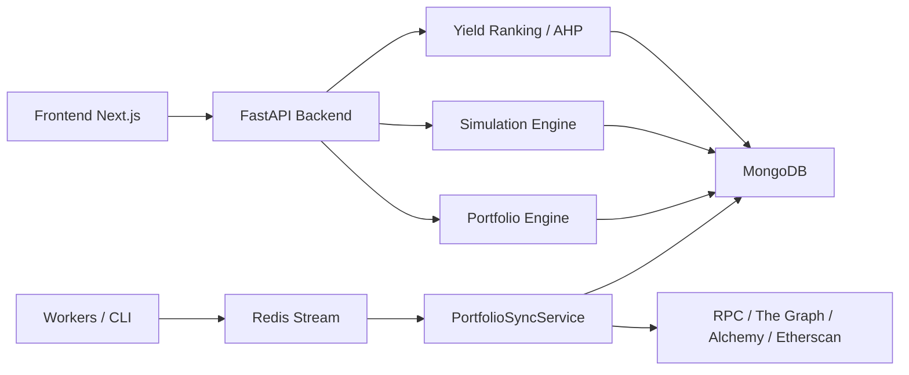
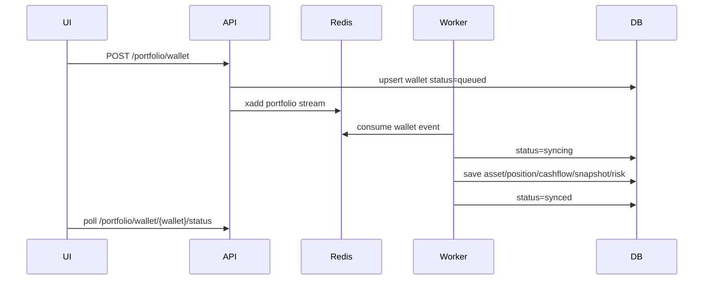
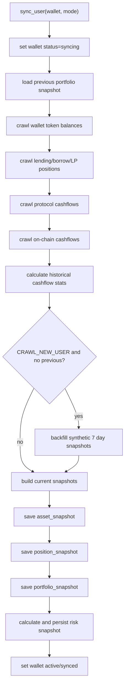

# AI-assisted DeFi Portfolio Analytics and Simulation

## 1. Mục tiêu sản phẩm

Dự án xây dựng hệ thống quản lý, phân tích và mô phỏng danh mục DeFi cho ví người dùng. Hệ thống tập trung vào:

- Tổng hợp tài sản ví, vị thế lending/borrow và vị thế LP.
- Tính net worth, PnL, cost basis, transaction history.
- Theo dõi rủi ro từng vị thế.
- Mô phỏng tác động của các action như buy, swap, lend, borrow, provide liquidity.
- Không đưa ra khuyến nghị đầu tư; hệ thống chỉ cung cấp dữ liệu, phân tích và cảnh báo.

Giao thức hiện tại tập trung vào Aave, Compound và Uniswap. Curve đã bị loại khỏi hướng sản phẩm hiện tại.

## 2. Kiến trúc tổng quan



Các lớp chính:

- `frontend`: dashboard, markets, risk engine, simulator.
- `backend/data_engine`: crawl price, yield, wallet asset, protocol positions, on-chain cashflow.
- `backend/portfolio_engine`: tổng hợp portfolio, analytics, PnL, risk, simulation.
- `backend/decision_engine`: ranking market bằng AHP.
- `backend/shared/repositories`: repository MongoDB, chuẩn hoá dữ liệu camelCase/snake_case.
- `Redis Stream`: queue sync ví người dùng.

## 3. Luồng user và trạng thái ví

Hệ thống có 2 loại user:

- Guest wallet: vừa connect ví, chưa ghi nhận vào hệ thống. Chỉ dùng được API lấy dữ liệu sẵn nếu có.
- Tracked wallet / Update Plus: user bấm Update Plus, hệ thống add wallet vào queue và crawl đầy đủ dữ liệu.

Luồng add wallet:



CLI liên quan:

```bash
cd backend
python3 -m cli portfolio_stream_worker
python3 -m cli portfolio_sync_wallet <wallet> --mode SYNC
python3 -m cli portfolio_sync_wallet <wallet> --mode CRAWL_NEW_USER
python3 -m cli portfolio_reset_wallet <wallet>
```

## 4. Data Engine

### 4.1 Price data

Price service đọc token support từ DB, chuẩn hoá symbol và lấy giá hiện tại/lịch sử.

Nguyên tắc fallback:

1. Dùng symbol chuẩn hoá, ví dụ `BTC` có thể map về `WBTC` nếu DB chỉ support `WBTC`.
2. Với giá quá khứ, dùng price snapshot gần timestamp giao dịch.
3. Nếu không có snapshot đúng thời điểm, dùng bản ghi gần nhất.
4. Nếu vẫn không có, fallback về current price khi cần hiển thị.

Collection chính:

- `token`
- `price_snapshot`

### 4.2 Yield data

Yield worker crawl market lending và LP:

- Lending: supply APR, borrow APR, stable borrow APR, max LTV, liquidation threshold.
- LP: pool APR, total APR, TVL, token pair, fee tier.

Yield snapshot được lưu để phục vụ:

- Market ranking.
- Risk engine.
- Synthetic 7 day portfolio snapshot khi user mới add ví.

Collection chính:

- `yield`
- `yield_snapshot`

### 4.3 Wallet asset

`WalletService.get_wallet_portfolio(wallet)` crawl balance token support của ví, gắn:

- `symbol`
- `balance`
- `price`
- `valueUsd`
- metadata token

Chỉ token support mới nên được đưa vào portfolio analytics chính.

### 4.4 Protocol position

`PortfolioSyncService` lấy vị thế từ các provider:

- Aave V3
- Compound
- Uniswap

Vị thế lending/borrow lưu:

- `protocol`
- `marketId`
- `symbol`
- `side`: `LENDER`, `COLLATERAL`, `BORROWER`
- `balance`
- `valueUsd`
- `supplyApr`
- `borrowApr`
- `maxLtv`
- `liquidationThreshold`

Vị thế LP lưu:

- `type=amm`
- `asset=[token0, token1]`
- `amount0`, `amount1`
- `depositedToken0`, `depositedToken1`
- `withdrawnToken0`, `withdrawnToken1`
- `tickLower`, `tickUpper`
- `feeTier`
- `collectedFeeUsd`

### 4.5 Cashflow và on-chain transactions

Cashflow gom cả event protocol và on-chain transaction:

- Protocol events: deposit, withdraw, borrow, repay.
- On-chain token transfer/swap: transfer_in, transfer_out, buy, sell.
- Gas fee và recorded value.

Trường quan trọng:

- `wallet`
- `txId` / `txHash`
- `timestamp`
- `action`
- `symbol`
- `amount`
- `amountUsd`
- `recordedAmountUsd`
- `priceAtTx`
- `priceSource`

`priceAtTx` là giá ước tính tại thời điểm transaction, lấy từ price snapshot gần timestamp. `recordedAmountUsd` là USD value hệ thống/crawler ghi nhận trực tiếp từ transaction/provider. Hai trường này khác nhau:

- `recordedAmountUsd`: giá trị USD được ghi nhận trong event hoặc crawler, có thể là provider-calculated.
- `priceAtTx`: đơn giá token tại thời điểm tx, dùng để tính `amount * priceAtTx`.

## 5. Portfolio Sync Flow

Luồng chính nằm trong `PortfolioSyncService.sync_user`.



### 5.1 Current snapshot

Mỗi lần sync tạo:

- `asset_snapshot`: token hold hiện tại.
- `position_snapshot`: lending/borrow/LP hiện tại.
- `portfolio_snapshot`: tổng hợp toàn ví.
- `position_risk_snapshot`: risk snapshot.

### 5.2 Synthetic 7 day backfill

Khi wallet mới add bằng `CRAWL_NEW_USER`, nếu chưa có previous snapshot, hệ thống tạo snapshot giả lập 7 ngày gần nhất.

Dữ liệu dùng:

- Balance hiện tại.
- Cashflow đã crawl.
- Historical price snapshot.
- Historical yield snapshot.

Ý nghĩa:

- UI có net worth history ngay sau khi add wallet.
- Đây là approximation, không phải historical truth tuyệt đối.

Cách dựng balance quá khứ:

- Với token hold, đi ngược từ balance hiện tại và đảo chiều các cashflow sau timestamp snapshot.
- Với lending collateral:
  - Deposit sau snapshot làm giảm balance quá khứ.
  - Withdraw sau snapshot làm tăng balance quá khứ.
- Với borrow:
  - Borrow sau snapshot làm giảm debt quá khứ.
  - Repay sau snapshot làm tăng debt quá khứ.

## 6. Công thức Portfolio

### 6.1 Token hold

Với mỗi asset:

```text
assetValueUsd = balance * price
assetPnlUsd = currentValueUsd - previousValueUsd
assetPnlPct = assetPnlUsd / previousValueUsd * 100
```

Tổng token hold:

```text
tokenHoldUsd = sum(assetValueUsd)
tokenHoldPnlUsd = sum(assetPnlUsd)
```

### 6.2 Position value

Lending/collateral:

```text
totalSupplyUsd = sum(valueUsd where side in LENDER, COLLATERAL and type != amm)
```

Borrow:

```text
totalBorrowUsd = sum(valueUsd where side == BORROWER and type != amm)
```

AMM/LP:

```text
totalAmmUsd = sum(valueUsd where type == amm)
```

Collateral:

```text
collateralUsd = sum(valueUsd where isCollateral == true)
```

### 6.3 Principal và interest

Từ cashflow:

```text
supplyPrincipalUsd = depositUsd - withdrawUsd
borrowPrincipalUsd = borrowUsd - repayUsd
supplyInterestUsd = totalSupplyUsd - supplyPrincipalUsd
borrowInterestUsd = totalBorrowUsd - borrowPrincipalUsd
netInterestUsd = supplyInterestUsd - borrowInterestUsd
```

### 6.4 Net worth

Công thức sản phẩm:

```text
netWorthUsd = tokenHoldUsd + supplyPrincipalUsd + totalAmmUsd + supplyInterestUsd - totalBorrowUsd
```

Tương đương:

```text
netWorthUsd = tokenHoldUsd + totalSupplyUsd + totalAmmUsd - totalBorrowUsd
```

trong trường hợp `totalSupplyUsd = supplyPrincipalUsd + supplyInterestUsd`.

### 6.5 Total PnL theo snapshot

```text
totalPnlUsd = currentNetWorthUsd - previousNetWorthUsd
```

Nếu chưa có previous snapshot:

```text
totalPnlUsd = 0
```

### 6.6 Dashboard PnL period

```text
todayUsd = currentNetWorthUsd - netWorthAtOrBefore(now - 1 day)
sevenDayUsd = currentNetWorthUsd - netWorthAtOrBefore(now - 7 days)
allTimeUsd = currentNetWorthUsd - firstNetWorthUsd
```

```text
periodPct = deltaUsd / referenceNetWorthUsd * 100
roiPct = allTimePct
```

### 6.7 Cost basis và transaction PnL

Transaction feed dùng average cost theo symbol.

Khi inflow:

```text
basis[symbol] += amount * priceAtTx
amountHold[symbol] += amount
```

Khi outflow/sell/withdraw/borrow:

```text
avgCost = basis[symbol] / amountHold[symbol]
consumed = min(txAmount, amountHold[symbol])
cost = avgCost * consumed
realizedPnl = txValueUsd - cost
basis[symbol] -= cost
amountHold[symbol] -= consumed
```

Với transfer out, realized PnL đang được set `0` để tránh hiểu nhầm transfer là trade.

Hold position PnL:

```text
unrealizedPnlUsd = currentValueUsd - costBasisUsd + realizedPnlUsd
pnlPct = unrealizedPnlUsd / costBasisUsd * 100
entryPrice = costBasisUsd / balance
```

## 7. Risk Engine

Risk engine nằm trong `PositionRiskService`.

### 7.1 Lending risk

Lending context:

```text
weightedCollateralUsd = sum(collateralValueUsd * liquidationThreshold)
debtUsd = sum(borrowPositionValueUsd)
healthFactor = weightedCollateralUsd / debtUsd
liquidationBufferUsd = weightedCollateralUsd - debtUsd
```

Nếu không có debt:

```text
healthFactor = 999
```

Price move to liquidation với collateral:

```text
collateralContribution = positionValueUsd * liquidationThreshold
priceMoveToLiquidationPct = (weightedCollateralUsd - debtUsd) / collateralContribution * 100
```

Price move to liquidation với borrowed asset:

```text
priceMoveToLiquidationPct = (weightedCollateralUsd / debtUsd - 1) * (debtUsd / borrowedAssetValueUsd) * 100
```

Forecast liquidation probability:

```text
volatility7d = volatility30d * sqrt(7)
z = (thresholdMove - forecast7dPct) / volatility7d
probability = normalCdf(z) or 1 - normalCdf(z)
```

Collateral side dùng downside threshold. Borrow side dùng upside threshold.

Risk score lending bắt đầu từ `12`, cộng điểm theo:

- thiếu liquidation threshold
- health factor thấp
- buffer mỏng
- trend bất lợi
- forecast probability cao
- volatility cao

Risk level:

```text
score >= 85 => CRITICAL
score >= 65 => HIGH
score >= 40 => MEDIUM
else LOW
```

### 7.2 Price trend model

Risk engine lấy price history 30 ngày.

Return:

```text
dailyReturnPct[i] = (price[i] - price[i-1]) / price[i-1] * 100
volatility30dPct = populationStdDev(dailyReturnPct)
change7dPct = (currentPrice - price7dAgo) / price7dAgo * 100
change30dPct = (currentPrice - firstPrice) / firstPrice * 100
maxDrawdown30dPct = (currentPrice - maxPrice) / maxPrice * 100
```

Forecast dùng linear regression trên log price:

```text
y = ln(price)
slope = covariance(dayIndex, y) / variance(dayIndex)
forecast1dPct = (exp(slope) - 1) * 100
forecast7dPct = (exp(slope * 7) - 1) * 100
confidence = 1 / (1 + residualStd * 10)
```

Trend:

```text
UP if forecast7dPct > max(volatility30dPct, 1.5)
DOWN if forecast7dPct < -max(volatility30dPct, 1.5)
else FLAT
```

### 7.3 LP risk

LP risk gồm:

- Impermanent loss.
- Range risk.
- Forecast out of range.
- Volatility cặp token.

Hold value:

```text
holdValueUsd =
    max(depositedToken0 - withdrawnToken0, 0) * price0
  + max(depositedToken1 - withdrawnToken1, 0) * price1
```

Current LP value:

```text
currentValueUsd = valueUsd or amount0 * price0 + amount1 * price1
```

Impermanent loss:

```text
impermanentLossUsd = currentValueUsd + collectedFeeUsd - holdValueUsd
impermanentLossPct = impermanentLossUsd / holdValueUsd * 100
```

Uniswap tick:

```text
currentRatio = token0Price or price1 / price0
currentTick = ln(currentRatio) / ln(1.0001)
inRange = tickLower <= currentTick <= tickUpper
distanceToRangeEdgePct = min(abs(currentTick - tickLower), abs(tickUpper - currentTick)) / (tickUpper - tickLower) * 100
```

Forecast range:

```text
ratioChange = (token1Forecast7dPct - token0Forecast7dPct) / 100
forecastRatio = currentRatio * (1 + ratioChange)
forecastTick7d = ln(forecastRatio) / ln(1.0001)
forecastOutOfRange = forecastTick7d < tickLower or forecastTick7d > tickUpper
```

Forecast IL:

```text
relativePriceChange = (1 + token0Forecast7d) / (1 + token1Forecast7d)
forecastIlPct = (2 * sqrt(relativePriceChange) / (1 + relativePriceChange) - 1) * 100
forecastIlUsd = holdValueUsd * forecastIlPct / 100
```

LP score bắt đầu từ `14`, cộng điểm theo:

- out of range
- gần boundary
- forecast out of range
- IL hiện tại đáng kể
- forecast IL đáng kể
- volatility cao

### 7.4 Portfolio risk aggregate

```text
totalRiskValueUsd = sum(abs(positionValueUsd))
riskScore = sum(positionRiskScore * abs(positionValueUsd)) / totalRiskValueUsd
highRiskValueUsd = sum(abs(valueUsd) where level in HIGH, CRITICAL)
highRiskRatio = highRiskValueUsd / totalRiskValueUsd
```

## 8. Simulation Engine

Simulation chạy qua:

```http
POST /simulation/{wallet}
```

Payload hỗ trợ:

- `price_shock`
- `lend`
- `stake`
- `borrow`
- `swap`
- `provide_liquidity`

### 8.1 Base summary

Trước simulation:

```text
tokenHoldUsd = latest.tokenHoldUsd or sum(asset.valueUsd)
positionUsd = totalSupplyUsd + totalAmmUsd
borrowUsd = totalBorrowUsd
netWorthUsd = tokenHoldUsd + positionUsd - borrowUsd
```

### 8.2 Fee model

Fee model dùng cashflow on-chain:

```text
gasBase = medianGasUsd or avgGasUsd or defaultSwapGas
```

Default:

```text
swap = 8
lend = 6
stake = 6
borrow = 9
addLiquidity = 14
priceShock = 0
```

Derived:

```text
lendGas = max(gasBase * 0.75, 6)
borrowGas = max(gasBase, 9)
addLiquidityGas = max(gasBase * 1.8, 14)
swapProtocolFeePct = 0.3
```

### 8.3 Price shock

```text
tokenDeltaUsd = assetValueUsd * shockPct / 100
positionDeltaUsd = positionValueUsd * avgMatchedTokenShockPct / 100
borrowDeltaUsd = borrowValueUsd * matchedShockPct / 100
```

```text
afterTokenHoldUsd = beforeTokenHoldUsd + tokenDeltaUsd
afterPositionUsd = beforePositionUsd + positionDeltaUsd
afterBorrowUsd = beforeBorrowUsd + borrowDeltaUsd
afterNetWorthUsd = afterTokenHoldUsd + afterPositionUsd - afterBorrowUsd
```

### 8.4 Lend / Stake

```text
valueUsd = amount * tokenPrice
gas = payload.gasUsd or feeModel.gas[action]
annualIncomeUsd = valueUsd * supplyApr / 100
```

```text
afterTokenHoldUsd = beforeTokenHoldUsd - min(valueUsd, walletTokenValueUsd)
afterPositionUsd = beforePositionUsd + valueUsd
afterNetWorthUsd = afterTokenHoldUsd + afterPositionUsd - beforeBorrowUsd - gas
```

### 8.5 Borrow

```text
valueUsd = amount * tokenPrice
gas = payload.gasUsd or feeModel.gas.borrow
annualBorrowCostUsd = valueUsd * borrowApr / 100
stressedDebtUsd = valueUsd * max(1 + shockPct / 100, 0)
```

```text
afterTokenHoldUsd = beforeTokenHoldUsd + max(valueUsd - gas, 0)
afterBorrowUsd = beforeBorrowUsd + valueUsd
afterNetWorthUsd = afterTokenHoldUsd + beforePositionUsd - afterBorrowUsd
```

### 8.6 Swap / Buy token

Buy token trên UI hiện được mô phỏng bằng payload `swap`.

```text
valueUsd = amountFrom * fromPrice
totalTradeFeePct = slippagePct + protocolFeePct
receivedValueUsd = valueUsd * (1 - totalTradeFeePct / 100)
receivedAmount = receivedValueUsd / toPrice
gas = payload.gasUsd or feeModel.gas.swap
```

```text
afterTokenHoldUsd =
    beforeTokenHoldUsd
  + receivedValueUsd
  - min(valueUsd, walletFromTokenValueUsd)
  - gas

afterNetWorthUsd = afterTokenHoldUsd + beforePositionUsd - beforeBorrowUsd
```

### 8.7 Provide liquidity

```text
value0 = amount0 * price0
value1 = amount1 * price1 if amount1 > 0 else value0
positionValueUsd = value0 + value1
gas = payload.gasUsd or feeModel.gas.addLiquidity
```

IL:

```text
ratio = max(1 + shockPct / 100, 0.0001)
ilPct = (2 * sqrt(ratio) / (1 + ratio) - 1) * 100
ilUsd = positionValueUsd * ilPct / 100
```

Projected fee:

```text
projectedAnnualFeeIncomeUsd = positionValueUsd * apr / 100
```

After:

```text
afterTokenHoldUsd =
    beforeTokenHoldUsd
  - min(value0, walletToken0ValueUsd)
  - min(value1, walletToken1ValueUsd)

afterPositionUsd = beforePositionUsd + positionValueUsd
afterNetWorthUsd = afterTokenHoldUsd + afterPositionUsd - beforeBorrowUsd - gas
```

## 9. Market Ranking / AHP

Endpoint:

```http
GET /yields?profile=balanced&limit=100
GET /yields?yield_weight=0.4&safety_weight=0.4&efficiency_weight=0.2
```

Mục tiêu:

- Cho nhà đầu tư xem market lending/LP theo nhóm chỉ số dễ hiểu.
- Không gọi API mỗi lần kéo slider; UI chỉ gọi lại khi user Apply.

Nhóm chỉ số:

- Yield: APR/APY/current return.
- Safety: TVL, protocol, liquidation threshold, volatility/risk-related metrics nếu có.
- Efficiency: capital efficiency, borrow/supply relation, fee/TVL.

AHP tổng quát:

```text
score = normalizedYield * yieldWeight
      + normalizedSafety * safetyWeight
      + normalizedEfficiency * efficiencyWeight
```

Trọng số có thể theo preset hoặc custom. Tổng weight nên được normalize về 1.

## 10. Frontend

Các page chính:

- `/dashboard`: net worth, allocation, holdings + positions, transaction history.
- `/markets`: asset overview, token chart, yield ranking, AHP model.
- `/risk-engine`: risk theo từng vị thế.
- `/simulator`: action simulator.

### 10.1 Dashboard

Dashboard hiển thị:

- Net worth banner.
- Net worth history.
- Donut allocation.
- Portfolio holdings: token hold + lending/borrow/LP positions.
- Transaction history.
- Update Plus panel khi ví chưa được tracked.

### 10.2 Simulator UX

Simulator hiện chia 60/40:

- 60% trái: environment, wallet context, configure draft.
- 40% phải: scenario actions + simulation result.

Action queue cập nhật context tạm tính ở frontend:

- Swap/buy: trừ token bán, cộng token nhận nếu có price.
- Lend/loop/LP: trừ token dùng làm collateral/liquidity.
- Feasibility check dựa trên context sau các action đã queue, không chỉ snapshot ban đầu.

Lưu ý: backend hiện simulate từng payload một lần. Queue ở frontend đang là UX layer; chưa có batch simulation aggregate backend.

## 11. API chính

Portfolio:

```http
POST /portfolio/wallet
GET /portfolio/wallet/{wallet}/status
GET /portfolio/{wallet}
GET /portfolio/positions/{wallet}
```

Analytics:

```http
GET /portfolio/analytics/{wallet}
GET /portfolio/analytics/{wallet}/transactions?limit=100
GET /portfolio/analytics/{wallet}/positions-pnl
GET /portfolio/analytics/{wallet}/history?limit=90
GET /portfolio/analytics/{wallet}/risk
GET /portfolio/analytics/{wallet}/risk/history?limit=90
```

Yield:

```http
GET /yields
```

Simulation:

```http
POST /simulation/{wallet}
POST /simulation/intent/parse
```

## 12. MongoDB collections

Các collection chính:

- `wallets`: trạng thái wallet, active/synced.
- `token`: token support.
- `price_snapshot`: lịch sử giá token.
- `yield`: market hiện tại.
- `yield_snapshot`: lịch sử market/yield.
- `asset_snapshot`: snapshot token hold theo wallet.
- `position_snapshot`: snapshot position lending/borrow/LP.
- `portfolio_snapshot`: snapshot tổng hợp portfolio.
- `cashflow`: transaction/cashflow đã chuẩn hoá.
- `onchain_transactions`: raw/on-chain tx metadata nếu crawler lưu riêng.
- `position_risk_snapshot`: risk snapshot portfolio và từng position.

Chuẩn đặt tên mới nên dùng camelCase ở API/UI. Repository có lớp chuyển đổi để làm việc với dữ liệu cũ/snake_case khi cần.

## 13. Công thức và giả định cần kiểm chứng

Các phần dưới đây đang là approximation hoặc cần review kỹ hơn trước khi coi là chuẩn tài chính.

### 13.1 Synthetic 7 day backfill

Backfill 7 ngày là snapshot giả lập từ current balance + cashflow + historical price/yield. Nếu cashflow thiếu hoặc crawler không thấy đủ transfer, snapshot quá khứ có thể lệch.

### 13.2 Supply interest và borrow interest

```text
supplyInterestUsd = totalSupplyUsd - supplyPrincipalUsd
borrowInterestUsd = totalBorrowUsd - borrowPrincipalUsd
```

Công thức này phụ thuộc cashflow đầy đủ. Nếu thiếu deposit/withdraw/borrow/repay lịch sử, interest có thể sai.

### 13.3 Position PnL theo previous snapshot

```text
positionPnlUsd = currentValueUsd - previousValueUsd
```

Đây là PnL theo snapshot gần nhất, không phải full realized/unrealized PnL chuẩn kế toán.

### 13.4 LP impermanent loss

Risk engine dùng deposited/withdrawn và current LP value để ước tính IL. Simulation dùng công thức 50/50 constant-product.

Cần kiểm chứng nếu:

- Uniswap V3 concentrated liquidity không phải full-range 50/50.
- Fee tier và liquidity range làm tỷ trọng token thay đổi.
- Position có nhiều lần add/remove liquidity.

### 13.5 LP range tick

```text
currentTick = ln(priceRatio) / ln(1.0001)
```

Cần đảm bảo `priceRatio` đúng chiều token0/token1 theo Uniswap pool. Nếu đảo chiều token, range risk sẽ sai.

### 13.6 Borrow simulation

Borrow simulation hiện chưa tính health factor chính xác sau khi borrow dựa trên toàn bộ collateral threshold. Nó chỉ cảnh báo nếu không có collateral và tính debt stress theo borrowed token.

### 13.7 Swap simulation

Swap dùng:

```text
totalTradeFeePct = slippagePct + protocolFeePct
```

Chưa tính:

- real route
- pool liquidity
- price impact động
- MEV
- exact Uniswap quote

### 13.9 Risk forecast

Forecast dùng linear regression trên log price 30 ngày. Đây là mô hình thống kê nhẹ, không phải ML/AI phức tạp. Phù hợp để cảnh báo xu hướng và volatility, không phù hợp để dự báo giá chính xác.

## 14. Hướng nâng cấp tiếp theo

Ưu tiên kỹ thuật:

1. Batch simulation backend: nhận danh sách action và trả về state sau từng action.
2. Health factor simulation sau borrow/lend/loop dựa trên toàn bộ collateral/debt.
3. Uniswap quote thật qua router/quoter để tính swap fee, price impact và LP input ratio.
4. LP risk theo Uniswap V3 exact math thay vì approximation 50/50.
5. Chuẩn hoá hoàn toàn camelCase ở DB layer và migration dữ liệu cũ.
6. Thêm test cho công thức net worth, cashflow basis, risk, simulation.
7. Mở rộng NLP intent như helper nhập liệu, nhưng không thay thế form simulation.

Ưu tiên sản phẩm:

1. Giải thích nguồn dữ liệu và độ tin cậy trên UI.
2. Gắn tag `estimated`, `observed`, `synthetic` cho snapshot/transaction.
3. Cho phép user so sánh nhiều scenario.
4. Tách risk engine thành module chuyên sâu riêng.
5. Thêm report export cho portfolio/risk/simulation.
